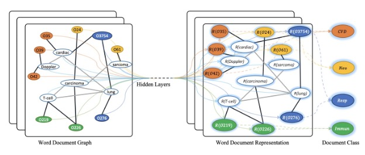
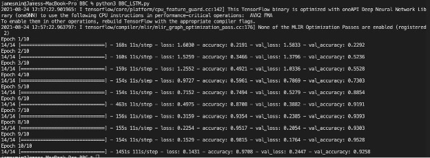

# BBC-Full-Text-Document-Classification-with-GCN

Task: This exercise was based on an article written by Yao, Mao, and Luo in 2018 concerning a
Multiclass-text-classification program using a Graph Convolutional Network Model called a
“Text-GCN.” (https://arxiv.org/pdf/1809.05679.pdf). Based on the Kipf and Welling paper “Semi-Supervised Classification with Graph Convolutional Networks” a GCN is a multilayer neural network that operates directly on a graph and induces embedding vectors of nodes based on properties of their neighborhoods. So, imagine a graph with 9 nodes, where 8 nodes are all connected to 1 node in the center. All the neighboring nodes would pass their messages or datas about itself to the middle node, and the middle node would send out its message to the 8 other nodes. Each node will have a feature vector and you will multiply each vector with a weight matrix and pass it to its neighbors, then you add everything up, and finally you pass it through some form of non-linearity or activation function.

A Text-GCN uses words and documents as nodes. So the total number of nodes in the graph equals the number of documents plus the number of unique words in the corpus. 

As one can see in this graph the words are the word nodes and the nodes with the “O” are the document nodes. The black bold edges are Document to word edges, the gray thin edges are word-word edges. The bold edges represent that these words occur in the documents that it is linked to, and the gray edges represent that these words co occur in a document within a window size of 20. Lastly, the different colors represent different documents as classes.
Initially they set the feature matrix to be an identity matrix, which means that every word or document is represented as a one-hot vector. For the weights of the edges between a document node and a word node, the term frequency-inverse document frequency(TF-IDF) of the word in the document is used; where the term frequency is the number of times the word appears in the document, and the inverse document frequency is the logarithmically scaled inverse fraction of the number of documents that contain the word. For the weights of the edges between words, they utilize global word co occurrence information by using a fixed size sliding window on all documents, in the corpus to gather co occurrence statistics.  For this they use Pointwise mutual information(PMI).  The window size used is 20 and the equation for the PMI can be seen in the notebook.
I used a dataset from Kaggle.com called “BBC Full Text Document Classification,” which has a total of 2226 documents that are separated into 5 different categories(business, entertainment, politics, sport, and tech). The goal is to train and test the Text-GCN on this dataset. We followed closely the model the authors of the article on Text-GCN made from Yao’s github page: https://github.com/yao8839836/text_gcn. There, the authors used Tensorflow, however, I decided to use Pytorch instead.

As one can see in this graph the words are the word nodes and the nodes with the “O” are the document nodes. The black bold edges are Document to word edges, the gray thin edges are word-word edges. The bold edges represent that these words occur in the documents that it is linked to, and the gray edges represent that these words co occur in a document within a window size of 20. Lastly, the different colors represent different documents as classes.
Initially they set the feature matrix to be an identity matrix, which means that every word or document is represented as a one-hot vector. For the weights of the edges between a document node and a word node, the term frequency-inverse document frequency(TF-IDF) of the word in the document is used; where the term frequency is the number of times the word appears in the document, and the inverse document frequency is the logarithmically scaled inverse fraction of the number of documents that contain the word. For the weights of the edges between words, they utilize global word co occurrence information by using a fixed size sliding window on all documents, in the corpus to gather co occurrence statistics.  For this they use Pointwise mutual information(PMI).  The window size used is 20 and the equation for the PMI can be seen in the notebook.
I used a dataset from Kaggle.com called “BBC Full Text Document Classification,” which has a total of 2226 documents that are separated into 5 different categories(business, entertainment, politics, sport, and tech). The goal is to train and test the Text-GCN on this dataset. We followed closely the model the authors of the article on Text-GCN made from Yao’s github page: https://github.com/yao8839836/text_gcn. There, the authors used Tensorflow, however, I decided to use Pytorch instead.

Training and Testing Results
We use 10% of the training data for the validation set, however, the best results for training and testing split can be found below. After building the text graph we feed the graph into a 2 layer GCN, but in the second layer instead of the Relu as the activation function, we pass the second layer through a softmax classifier to predict our classification.
I found that the accuracy of the test was very low compared to what the article made it out to be.
One reason could have been that the BBC dataset is quite smaller than the dataset that is used by Yao and his team. In the article they used 5 different data sets which ranged from 7000-18,000 each. The BBC dataset of only 2226 documents was significantly smaller. If I were to do this project again, I would try it with a larger dataset. Here are the results of the training and testing:
1.	Train and test split at 60-40:
a.	Train: [2021/8/21 17:14:21] Epoch: 12, train_loss= 1.52159, train_acc= 0.80532, val_loss= 1.61112, val_acc= 0.21805, time= 0.87800
b.	[2021/8/21 17:16:05] loss= 1.74432, accuracy= 0.19663, time= 0.29944
2.	Train and test split at 50-50:
a.	Train: [2021/8/21 17:03:21] Epoch: 12, train_loss= 1.52824, train_acc= 0.82817, val_loss= 1.61091, val_acc= 0.25225, time= 0.85076
b.	Test: [2021/8/21 17:03:34]	loss= 1.62915, accuracy= 0.21743, time= 0.28541
3.	Train and test split at 90-10:
a.	Train: [2021/8/21 17:20:12] Epoch: 12, train_loss= 1.50240, train_acc= 0.71754, val_loss= 1.61239, val_acc= 0.21500, time= 0.89558
b.	Test: [2021/8/21 17:20:34]	loss= 1.61328, accuracy= 0.19283, time= 0.32498
4.	Train and test split at 80-20:
a.	Train: [2021/8/21 17:37:02] Epoch: 12, train_loss= 1.50282, train_acc= 0.76155, val_loss= 1.61290, val_acc= 0.20787, time= 0.86756
b.	Test: [2021/8/21 17:37:20]	loss= 1.61527, accuracy= 0.24944, time= 0.28872
5.	Train and test split at 70-30:
a.	Train: [2021/8/21 17:40:27] Epoch: 12, train_loss= 1.51216, train_acc= 0.75820, val_loss= 1.61355, val_acc= 0.18065, time= 0.90067
b.	Test: [2021/8/21 17:40:48]	loss= 1.62028, accuracy= 0.21257, time= 0.29727
6.	Train and test split at 40-60:
a.	Train:[2021/8/21 17:47:08] Epoch: 12, train_loss= 1.53800, train_acc= 0.86142, val_loss= 1.61195, val_acc= 0.13483, time= 0.87957
b.	Test: [2021/8/21 17:47:20]	loss= 1.64000, accuracy= 0.20599, time= 0.29954
7.	Train and test split at 80-20, with word vector cosine similarity as weights:
a.	Train: [2021/8/21 19:51:21] Epoch: 12, train_loss= 1.51065, train_acc= 0.73283, val_loss= 1.61231, val_acc= 0.19101, time= 0.88708
b.	Test:[2021/8/21 19:51:25]	loss= 1.61458, accuracy= 0.22472, time= 0.29094

BBC Full Text Document Classification with LSTM
In Yao’s paper his Text-GCN model outperformed a LSTM text classifier. Therefore, I also wanted to build a multi-class LSTM text classifier with the BBC dataset in order to compare the two models. I used the same clean string function used in Yao’s and followed a LSTM model used by dikshabhati2002 in kaggle for a multi-class text classifier. This model used a Bidirectional LSTM model from Keras Tensorflow, it used a 40% dropout rate, a dense Relu activation function for the first layer and the second layer a dense softmax function. In the compiler, it uses ‘categorical_crossentropy’ for its loss function and ‘adam’ for the optimizer. After 10 epochs the training accuracy showed to be .9708 and the test accuracy to be .9258, out performing the Text-GCN by .67636. Running 10 epochs can take up to one hour depending on your CPU. With the amount of memory granted by Kaggle, one cannot run all 10 epochs. The memory maxes out after 4 epochs. Therefore, I had to train and test this model separately on my CPU and it took roughly 1 hour and 5 minutes.

Along with the dataset and files that is attached to this document, one can find these two implementations on Kaggle:
1.	https://www.kaggle.com/jamesmin90/bbc-full-text-document-classification-with-gcn
2.	https://www.kaggle.com/jamesmin90/bbc-full-text-document-classification-with-lstm

